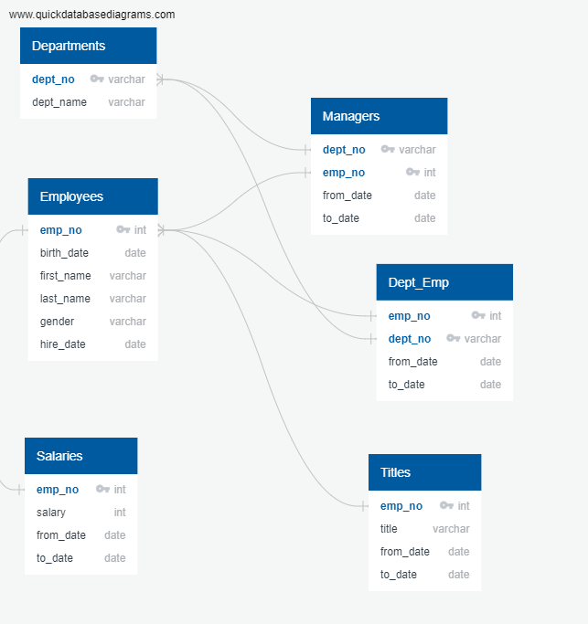

# Pewlett-Hackard-Analysis
## Brief project summary
### To obtain the potential employees who are retiring and stay as mentors I took information from the current employees table such as their first name and last name. And joined the retirement info table with only employee number. I also joined the titles and salaries tables to include those colums in the final table. 
### For the most recent data of mentors I used the count, distint on and partition by functions in order to remove duplicate values.
### Lastly, for employees who are ready for mentors: I added the focus columns and filtered it with the function 'where' by birth date and to date. The filter returns current employees who will be ready to fill in the positions of the retirees. 

SELECT ri.emp_no,
	ce.first_name,
	ce.last_name,
	t.title,
	t.from_date,
	s.salary
INTO mentor_info
FROM current_emp as ce
INNER JOIN retirement_info AS ri
ON (ce.emp_no = ri.emp_no)
INNER JOIN titles AS t
ON (ri.emp_no = t.emp_no)
INNER JOIN salaries AS s
ON (t.emp_no = s.emp_no);

#### Exammple:
| emp_no | first_name | last_name | title | from_date | salary | 
| :---: | :---: | :---: | :---: | :---: | :---: | 
| 10001 | Georgi | Facello | Senior Engineer | 1986-06-26 | 60117 | 

SELECT * FROM mentor_info
ORDER BY from_date DESC;

### Example:
| emp_no | first_name | last_name | title | from_date | salary | 
| :---: | :---: | :---: | :---: | :---: | :---: | 
| 206731 | Fuoc | Ramras | Senior Engineer | 2002-08-01 | 47835 | 

SELECT * FROM
  (SELECT *, count(*)
  OVER
    (PARTITION BY
      first_name,
      last_name
    ) AS count
  FROM mentor_info) tableWithCount
  WHERE tableWithCount.count > 1;
  
 ### Example:
| emp_no | first_name | last_name | title | from_date | salary | count |
| :---: | :---: | :---: | :---: | :---: | :---: | :---:|
| 61761 | Aamer | Feinberg | Senior Staff | 1999-11-03 | 45996 | 2 |
 
SELECT DISTINCT ON (first_name, last_name) * FROM mentor_info;

### Example:
| emp_no | first_name | last_name | title | from_date | salary | 
| :---: | :---: | :---: | :---: | :---: | :---: | 
| 50814 | Aamer | Daescu | Senior Engineer | 1988-09-16 | 49220 |

DELETE FROM mentor_info WHERE mentor_info.emp_no NOT IN 
(SELECT emp_no FROM (
    SELECT DISTINCT ON (first_name, last_name) *
  FROM mentor_info) AS emp_no);
 ### Deleted duplicates.
 
SELECT COUNT(m.emp_no), m.title
INTO per_title
FROM mentor_info AS m
GROUP BY m.title
ORDER BY m.title;

### Example:

| count | title |  
| :---: | :---: | 
| 1611 | Assistant Engineer |

SELECT e.emp_no,
	e.first_name,
	e.last_name,
	t.title,
	t.from_date,
	t.to_date
INTO ready_mentor
FROM employees as e
INNER JOIN titles as t
ON (e.emp_no = t.emp_no)
WHERE (e.birth_date BETWEEN '1965-01-01' AND '1965-12-31')
	AND t.to_date = ('9999-01-01');
  
| emp_no | first_name | last_name | title | from_date | to_date | 
| :---: | :---: | :---: | :---: | :---: | :---: | 
| 10476 | Kokou | Iisaka | Senior Staff | 1994-09-20 | 9999-01-01 |
